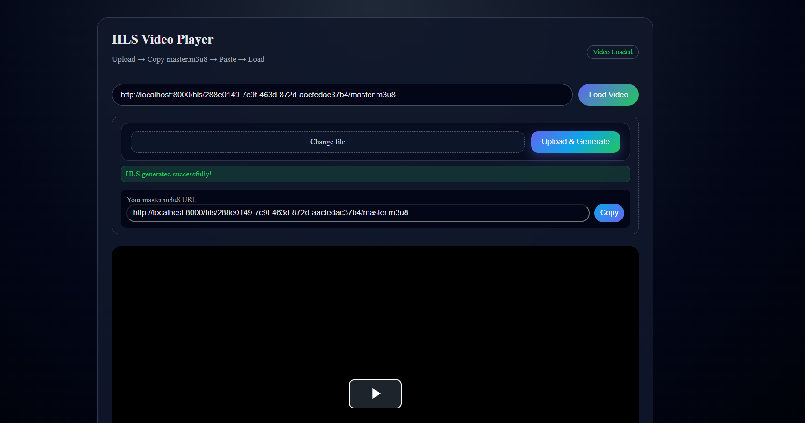

# Stream_App

**Minimal full-stack video streaming player** — upload videos, generate HLS, and play in the frontend.



## Structure
- **backend/** — Express API that handles uploads and serves HLS (`/hls`).
- **frontend/** — React + Vite UI for uploading and playing HLS streams.
- **Uploads** — `uploads/hls/` — generated HLS streams; `uploads/originals/` — uploaded sources.


## Quick start
1. **Start backend**: Install and run the Express server.
   ```bash
   cd backend
   npm install
   npm start
   ```

2. **Start frontend**: Start Vite dev server.
    ```bash
    cd frontend
    npm install
    npm run dev
    ```

## Environment
* **Backend**: see `backend/.env_sample (PORT, BASE_URL)`.
* **Frontend**: see `frontend/.env_sample (VITE_API_BASE_URL, VITE_DEMO_HLS_URL)`.

Note: Backend uses `ffmpeg` for HLS generation — ensure `ffmpeg` is installed and available in PATH.

## Usage

* **Upload endpoint**: POST /upload with multipart form field file. Returns JSON containing masterUrl on success.
* **Play**: Open the returned masterUrl in the frontend player or directly in a compatible HLS player.

## Notes & Tips

* **Max upload size**: Frontend enforces 100 MB; backend middleware also validates sizes.
* **Demo HLS**: A sample HLS exists at `uploads/hls/8efa24b2-110c-4cc4-8fb9-a2b1d00c31c0/master.m3u8`.
* **CORS**: Backend permits `http://localhost:3000` and `http://localhost:5173` by default.

## 🧠 Contribution
Contributions are welcome! Feel free to fork this repo and open a pull request to improve functionality or fix bugs.


## 👨‍💻 Author
Sohang Chaudhari

**GitHub**: [@sohangchaudhari133]( https://github.com/sohangchaudhari133/)
